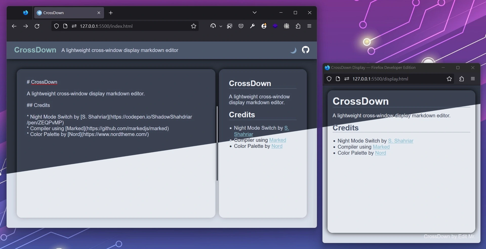

# CrossDown

A lightweight cross-window display markdown editor.

## Credits

* Night Mode Switch by [S. Shahriar](https://codepen.io/ShadowShahriar/pen/ZEQPvMP)
* Compiler using [Marked](https://github.com/markedjs/marked)
* Color Palette by [Nord](https://www.nordtheme.com/)
